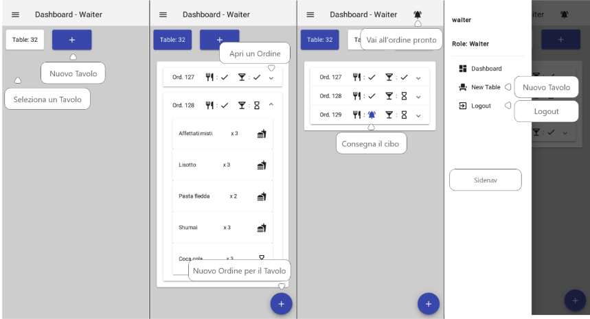

# 👨🏻‍🍳📱🖥 Restaurant App




Small web application to manage a restaurant built using the **MEAN** technology stack with **Typescript** and **SCSS**. 

Native desktop and mobile versions of the frontend application are created using the **Electron** and **Cordova** frameworks.

This project is the assignment for the course **Web Technologies and Applications**.

See **[requisitiProgetto.pdf](Documents/requisitiProgetto.pdf)** for more details on the assignment.

See **[Baccega_Sandro_865024.pdf](Documents/Baccega_Sandro_865024.pdf)** for more details on the implementation.

## 🔧 Building

```bash
cd frontend-angular-app
yarn install

cd ../backend-node-app
yarn install
```


## 🕹️ Usage

```bash
yarn start-backend

yarn start-web
yarn start-android
yarn start-desktop
```
